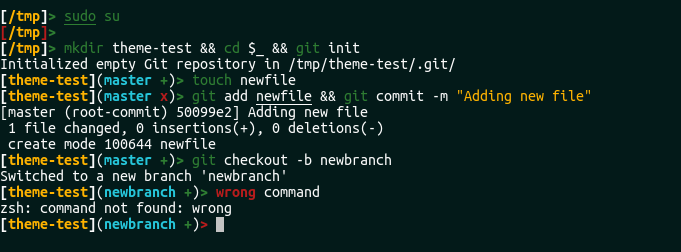

# Laconic
Simple oh-my-zsh theme.

## Instalation
- First you need to install [zsh](https://github.com/robbyrussell/oh-my-zsh/wiki/Installing-ZSH) and [oh-my-zsh](https://github.com/robbyrussell/oh-my-zsh).
- Then navigate to ~/.oh-my-zsh/custom/themes 
```bash
cd ~/.oh-my-zsh/custom/themes 
``` 
- Clone the repository
```bash
git clone https://github.com/Saka7/laconic.zsh-theme.git
```
- Delete useless files
```bash
rm -f LISCENSE README.md laconic.zsh-theme.png 
```
- Change theme in your ~/.zshrc file
```bash
ZSH_THEME="laconic"
```
- Update changes
```bash
source ~/.zshrc
```

## Screenshots
After instalation your terminal should looks like this



## License
Laconic is released under the [MIT License](https://opensource.org/licenses/MIT). 
