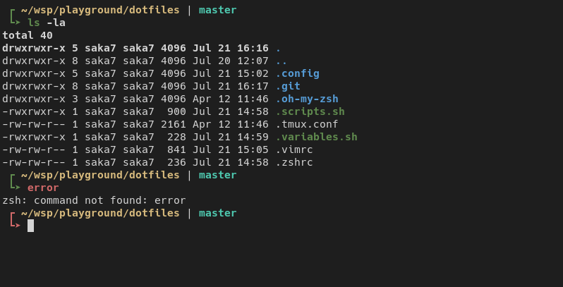

# Laconic
Simple zsh theme.

 

## Instalation

Download the theme
```bash
curl -o ~/.oh-my-zsh/themes/laconic.zsh-theme https://raw.githubusercontent.com/Saka7/laconic.zsh-theme/master/laconic.zsh-theme
```

Add to your `~/.zshrc` file
```bash
ZSH_THEME="laconic"
```

## License
Laconic theme is released under the [MIT License](https://opensource.org/licenses/MIT). 

